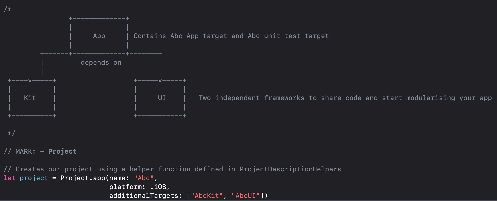

## iOS工程管理方案

直接使用Xcodeproj存在的问题，在于两个人同时修改工程配置时，很容易引入冲突，而且不容易手动解决。

所以除了Xcode之外，还产生了一些第三方的iOS项目管理方案。

### Tuist

[tuist homepage](https://github.com/tuist/tuist)

默认创建的配置文件就是这样的，还将工程分成了多个target。在不同target来实现不同的逻辑。

详细使用参考：https://docs.tuist.io/tutorial/get-started/

### XcodeGen

[XcodeGen homepage](https://github.com/yonaskolb/XcodeGen)

根据配置的yaml文件来生成工程文件。在使用时，将XcodeProj从git版本中移除，不再用git提交。更新代码后，用XcodeGen来生成就好。可以有效解决工程冲突的问题。

### 其它

除了上面这两种之外，还有[xcake](https://github.com/igor-makarov/xcake)、[struct](https://github.com/lyptt/struct)等。

